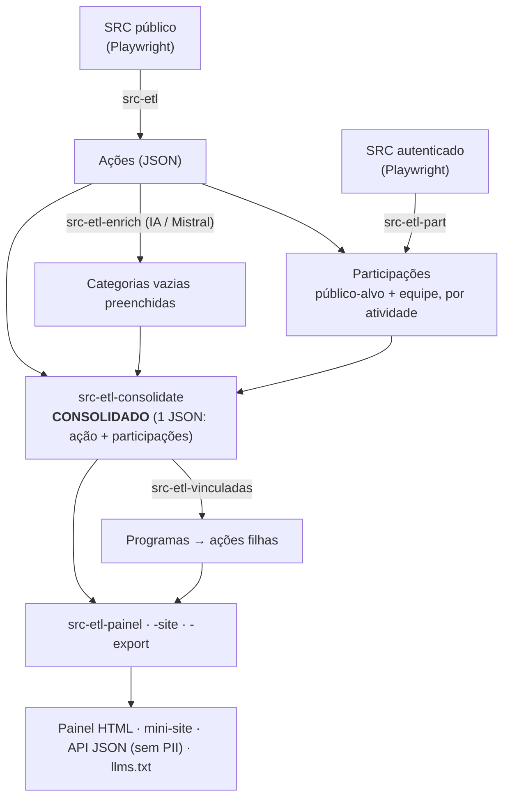
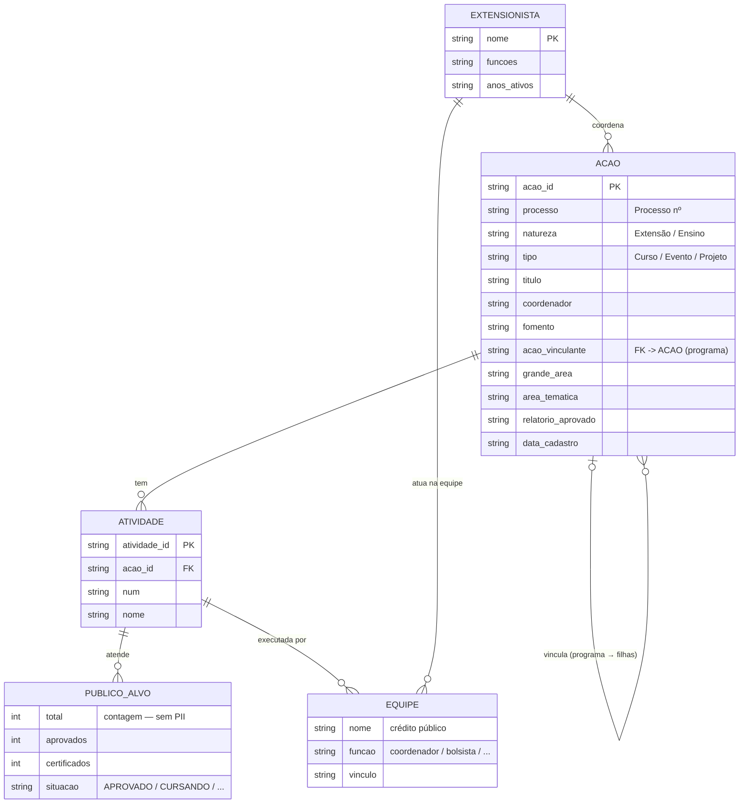

# SRC_ETL

Ferramenta de **ETL e análise das ações de extensão/ensino do SRC/Ifes**
(Sistema de Registro e Emissão de Certificados). Extrai ações públicas e
participações (com login), enriquece categorias com IA, consolida tudo e gera
um **painel analítico** publicável.

📊 **Painel do Campus Serra:** https://ifesserra-lab.github.io/SRC_ETL/

---

## O que ela faz



## Modelo de dados



> Privacidade: `PUBLICO_ALVO` (alunos atendidos) sai **apenas como contagens** — sem CPF,
> e-mail ou nome. `EQUIPE`/`EXTENSIONISTA` são crédito público de execução (nome + função).

## Instalação

```bash
pip install "git+https://github.com/ifesserra-lab/SRC_ETL.git"
playwright install chromium
```

Para a etapa autenticada e o enriquecimento, crie um `.env` (nunca commitado):

```
USER=seu_usuario_src
PASSWORD=sua_senha_src
MISTRAL_KEY=sua_chave_mistral     # opcional (enriquecimento de categorias)
```

## Passo a passo

```bash
# 1) Ações públicas de um campus (ou vários, ou todos)
src-etl --campus Serra --out data                 # um
src-etl --campus Serra Vitória --out data          # conjunto
src-etl --all --out data                           # todos
src-etl --campus Serra --workers 4 --out data      # paralelo (mais rápido)

# 2) Participações (público-alvo + equipe) — precisa de login
src-etl-part --from-index data/serra/_index.json --out data/participacoes --workers 3

# 3) (opcional) Completar categorias vazias com IA
src-etl-enrich --acoes data/serra --min-conf 0.6

# 4) Consolidar ação + participações num único JSON
src-etl-consolidate --out data/serra_consolidado.json

# 5) Painel analítico (HTML, tema Horizon, 4 abas)
src-etl-painel --out docs/index.html
```

Relatórios separados, se preferir:

```bash
src-etl-report      --out relatorio.html      # visão geral
src-etl-indicadores --out indicadores.html    # indicadores avançados
src-etl-vinculadas  --acoes data/serra        # programas guarda-chuva (vínculos)
```

## Comandos

| Comando | O que faz |
|---|---|
| `src-etl` | Baixa as ações públicas por campus (Playwright). `--workers` paraleliza. |
| `src-etl-part` | Público-alvo + equipe de cada atividade (login). `--workers` = N abas, 1 sessão. |
| `src-etl-enrich` | Preenche "Grande área" / "Área temática" vazias via Mistral (não-destrutivo). |
| `src-etl-consolidate` | Junta ação + participações num único JSON. |
| `src-etl-vinculadas` | Descobre ações filhas (programas guarda-chuva) na fonte oficial. |
| `src-etl-report` | Relatório-base (HTML agregado). |
| `src-etl-indicadores` | Indicadores avançados (alunos únicos, recorrência, turma...). |
| `src-etl-painel` | Painel único com 4 abas (visão geral, indicadores, rede, formados). |

## O painel (4 abas)

1. **Visão geral** — ações por natureza/tipo/fomento/ano, coordenadores, categorias (com inferência IA), certificação, ações sem participação.
2. **Indicadores** — alunos únicos vs participações, recorrência, tamanho de turma, aprovação/certificação por tipo, composição da equipe.
3. **Rede & programas** — programas guarda-chuva (LAMPEX, LEDS, "Ifes para todos") e rede de colaboração entre coordenadores.
4. **Formados na Extensão** — quantos formados participaram de ações de extensão (cruzamento com `data/formandos/`).

## Uso como biblioteca (Python)

```python
from src_etl import run, run_participacoes, processos_de_index, gerar_painel

run("Serra", out_dir="data")                                   # 1) ações
run_participacoes(processos_de_index("data/serra/_index.json"),
                  out_dir="data/participacoes", workers=3)     # 2) participações
gerar_painel(out_html="docs/index.html")                       # 5) painel
```

## Privacidade (importante)

- As **participações contêm dados pessoais** (nome, CPF, e-mail de alunos).
  Ficam **apenas locais** em `data/` (no `.gitignore`) — **nunca** commite nem publique.
- O **painel e os relatórios são agregados** (contagens, sem nomes/CPF/e-mail).
  São seguros para publicação; coordenadores(as) são dado público do sistema.
- Use somente com **acesso autorizado** ao SRC.

## Publicação (GitHub Pages via CI)

O painel é gerado **localmente** (onde ficam os dados) e commitado em `docs/`.
O workflow [`.github/workflows/pages.yml`](.github/workflows/pages.yml) faz o
deploy no GitHub Pages a cada push em `docs/` — o CI **não** acessa dados nem
credenciais.

## Desenvolvimento

```bash
pip install -e ".[dev]"
playwright install chromium
pytest
```

## Licença

MIT.
